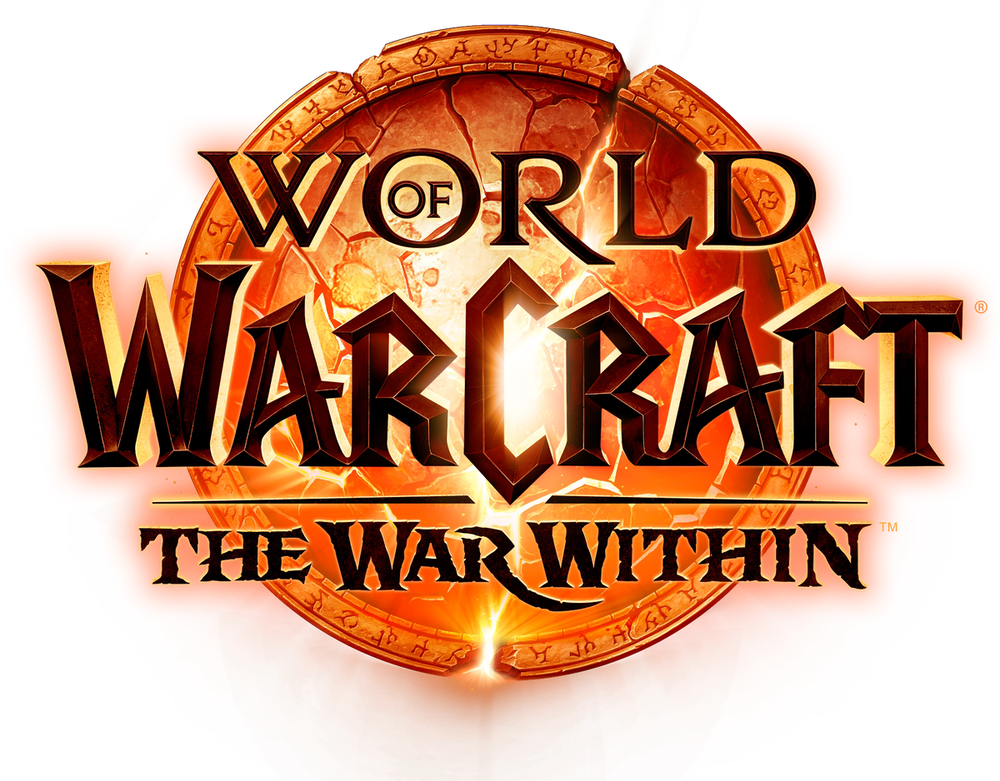

<!-- PROJECT SHIELDS -->
<!--
*** See the bottom of this document for the declaration of the reference variables
-->

[![Forks][forks-shield]][forks-url]
[![Stargazers][stars-shield]][stars-url]
[![Issues][issues-shield]][issues-url]
[![License][license-shield]][license-url]

<!-- Project Logo, Title, Short Description and Create Issue Buttons -->

   
  
  <h1 align="center">
    IcyBIS
  </h1>
  

    A World of Warcraft Retail Character Gearing Addon
     
     
    <a href="https://github.com/Louden7/IcyBIS/issues/new?labels=bug&template=bug-report---.md">Report Bug</a>
    ·
    <a href="https://github.com/Louden7/IcyBIS/issues/new?labels=enhancement&template=feature-request---.md">Request Feature</a>
  

## Introduction

IcyBIS is a lightweight and customizable, character gearing-oriented tooltip addon. It aims to improve your end game gearing progression by providing tooltip information for class and specialization PVE best in slot (BIS) items scraped weekly from the popular World of Warcraft guide website [Icy Veins](https://www.icy-veins.com). No more swapping back and forth to see if that dropped item is BIS according to the Icy Veins writers.

World of Warcraft (WoW) retail currently has two main end-game paths, the current raid and mythic plus season. The popular WoW guide website, Icy Veins plays into these two end-game paths by curating class and specialization specific BIS item sets. There is then a combination of the two for an overall BIS gear set.

In years past players would have to swap back and forth to see if an item is BIS in accordance to a guide. This addon was build to provide real time information within the in-game items tooltip stating if the item is a BIS and from what end-game content the item is from.

## Features

- Easily select what spec and [BIS table](#1-what-is-a-bis-table) to track.
- Minimalistic design with IcyBIS information added to **only** BIS tracked items.
- Lightweight and optimized providing zero impact to gaming.

## Installation

### Method 1: Via Addon Manager (Recommended)

1. Open your addon manager (e.g. CurseForge, WowUp).
2. Search for "IcyBIS".
3. Install the latest version.
4. Launch World of Warcraft, and the addon should be enabled by default.

### Method 2: Manual Installation

1. Download the latest release from [IcyBIS Releases](https://github.com/Louden7/IcyBIS/releases).
2. Unzip the folder and place it in your WoW Interface/AddOns directory:
   - For Windows: `C:\Program Files (x86)\World of Warcraft_retail\_\Interface\AddOns\`
   - For macOS: `/Applications/World of Warcraft/_retail_/Interface/AddOns/`
3. Restart WoW or type /reload in-game.

## Usage

### Configuration

### Slash Commands

## FAQ

### 1. What is a BIS Table?

A Best in slot table (BIS table) is a collection of gear items that can be obtained in specific or a combination of end game content. Currently Icy Veins writers create 3 "BIS tables", Overall BIS, Raid BIS and Mythic Plus BIS.

- **Overall BIS Table** can be comprised of Raid, Mythic Plus and crafted gear.
- **Raid BIS Table** is only comprised of items dropped in the current Raid content.
- **Mythic Plus BIS Table** is only comprised of items dropped in the current Mythic Plush season content.

## Changelog

## Contributing

Contributions to IcyBIS are welcome! You can submit bug reports, feature requests, or pull requests on [GitHub](https://github.com/Louden7/IcyBIS/issues). To avoid duplication of please search open and closed issues prior to opening a new one.

## License

This project is licensed under the GPL-3.0. See the [LICENSE](./LICENSE) file for details.

## Development Roadmap

I see this addon going many ways and the intention is to start small.

### Initial Release - v1.0.0

- The initial release will only load BIS items for the players class.
- BIS data will **only** be scraped and updated (if any changes) once a week.
  - Potentially Monday nights prior to the scheduled weekly NA maintenance.
- A simple settings UI where the player can toggle on/off class specializations and their respective BIS table. As well as a checkbox to toggle on/off the instance loot message when a BIS item drops.
- Have a workable button in the newly added addon compartment.
- Add information (class, specialization and BIS loot table) to the respective items tooltip.
- Send a instance (party or raid) message when a BIS item drops from content with the class, specialization and BIS loot table as well as the linked item.
- Will have a working slash command that displays help, print out the installed version and opens the settings frame.

### Future Ideas

- Add settings to override character specific class BIS items tooltip display.
  - Ex. As a Shaman I can see item X is a Marksman Hunters Overall BIS item.
- Add a setting to put the addon on "master loot" mode.
  - Master Loot mode would take the current instance (party or raid) players and instead of providing generic tooltip information on BIS items it would provide the players name, specialization and BIS loot table. This would be extremely helpful if master looting was used as the deciding players can see exactly who's BIS the item is.
- Addition of class colors for the tooltip text color.
- Addition of speciation images next or replacing the text within the tooltip.
- Include ilvl difference on tooltip
- Include % upgrade on tooltip

### TODO

- Add python functionality to update BuildDate in the .toc file.
- Verify specs match the id order. Can use in game lua script untitled 10

<!-- MARKDOWN LINKS & IMAGES -->
<!-- https://www.markdownguide.org/basic-syntax/#reference-style-links -->

[forks-shield]: https://img.shields.io/github/forks/Louden7/IcyBIS.svg?style=plastic
[forks-url]: https://github.com/Louden7/IcyBIS/network/members
[stars-shield]: https://img.shields.io/github/stars/Louden7/IcyBIS.svg?style=plastic
[stars-url]: https://github.com/Louden7/IcyBIS/stargazers
[issues-shield]: https://img.shields.io/github/issues/Louden7/IcyBIS.svg?style=plastic
[issues-url]: https://github.com/Louden7/IcyBIS/issues
[license-shield]: https://img.shields.io/github/license/Louden7/IcyBIS?style=plastic
[license-url]: https://github.com/Louden7/IcyBIS/blob/main/LICENSE
