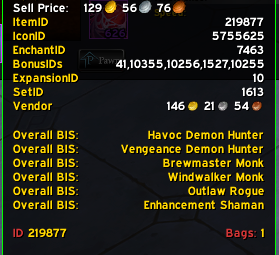
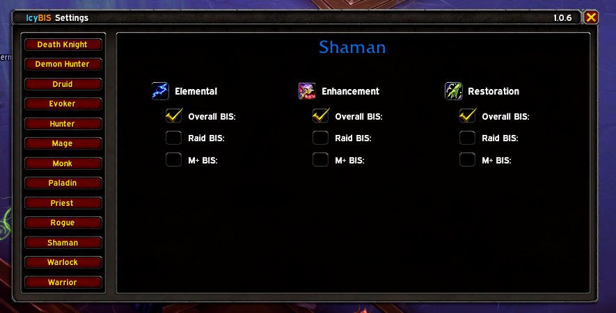
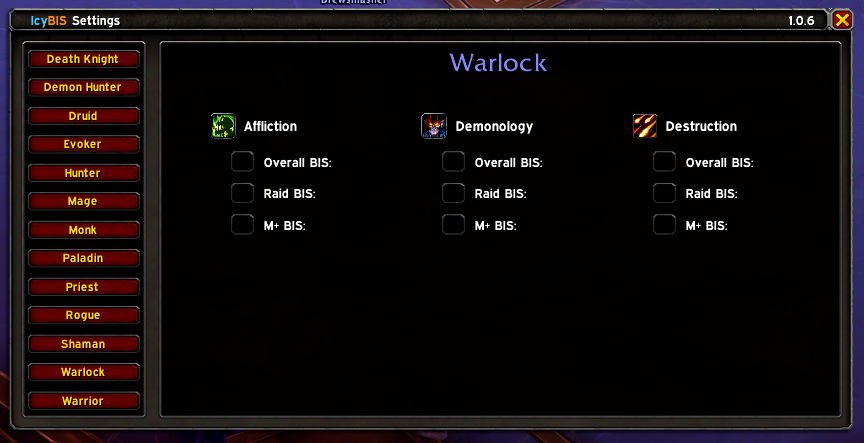

<a id="readme-top"></a>

<!-- PROJECT SHIELDS -->
<!-- *** See the bottom of this document for the declaration of the reference variables -->

[![Forks][forks-shield]][forks-url]
[![Stargazers][stars-shield]][stars-url]
[![GitHub Release][release-shield]][release-url]
[![CurseForge Downloads][curseforge-downloads-shield]][curseforge-downloads-url]
[![GitHub Downloads][github-downloads-shield]][github-downloads-url]
[![License][license-shield]][license-url]

<!-- Project Logo, Title, Short Description and Create Issue Buttons -->
<div align="center">
  <br />
  <a href="https://github.com/TinkerTech-Addons/IcyBIS">
    
  </a>
  <p align="center">
    <br />
    A World of Warcraft Retail best in slot management Addon
    <br />
    <br />
    <a href="https://github.com/TinkerTech-Addons/IcyBIS/issues/new?labels=bug&template=bug-report---.md">Report Bug</a>
    ·
    <a href="https://github.com/TinkerTech-Addons/IcyBIS/issues/new?labels=enhancement&template=feature-request---.md">Request Feature</a>
  </p>
</div>

## Introduction

IcyBIS is a lightweight and customizable, gearing-oriented best in slot management tooltip addon. It aims to improve your end game gearing progression by providing tooltip information for class and specialization PVE best in slot (BIS) items scraped weekly from the popular World of Warcraft guide website [Icy Veins](https://www.icy-veins.com). No more swapping back and forth to see if that dropped item is BIS according to the Icy Veins writers.

World of Warcraft (WoW) retail currently has two main end-game paths, the current raid and mythic plus season. The popular WoW guide website, Icy Veins plays into these two end-game paths by curating class and specialization specific BIS item sets. There is then a combination of the two as well as crafted items for an overall BIS gear set.

In years past players would have to swap back and forth to see if an item is BIS in accordance to a guide. This addon was build to provide real time information within the in-game items tooltip stating if the item is BIS and from what end-game content the item is from.

<p align="right">(<a href="#readme-top">back to top</a>)</p>

## Features

- Easily select what spec and [BIS table](#1-what-is-a-bis-table) to track.
- Minimalistic design with IcyBIS information added to **only** BIS tracked items.
- Lightweight and optimized providing zero impact to gaming.

### In Game BIS Tracked Tooltips

<p align="center">
  
  
  
</p>

<p align="right">(<a href="#readme-top">back to top</a>)</p>

## Installation

### Method 1: Via Addon Manager (Recommended)

1. Open your addon manager (e.g. CurseForge, WowUp).
2. Search for "IcyBIS".
3. Install the latest version.
4. Launch World of Warcraft, and the addon should be enabled by default.

### Method 2: Manual Installation

1. Download the latest release from [IcyBIS Releases](https://github.com/TinkerTech-Addons/IcyBIS/releases).
2. Unzip the folder and place it in your WoW Interface/AddOns directory commonly found in the paths below:
   - For Windows: `C:\Program Files (x86)\World of Warcraft\_retail_\Interface\AddOns\`
   - For macOS: `/Applications/World of Warcraft/_retail_/Interface/AddOns/`
3. Restart WoW or type /reload in-game.

<p align="right">(<a href="#readme-top">back to top</a>)</p>

## Usage

Once installed, IcyBIS will automatically load when the player enters the world. By default IcyBIS is configured **not** to track any [BIS Tables](#1-what-is-a-bis-table) but can easily be configured with character specific saved settings.

### Configuration

To configure IcyBIS open the settings and select the specialization and BIS Table you wish to track via clicking the respective checkbox.

<p align="center">
  
  
  
<p>

#### How to open IcyBIS settings

- Addon compartment

  - Navigate and open the newly added addon compartment.
  - Search for the IcyBIS addon.
  - Left click IcyBIS to open the settings.

    <p align="center">
      
    </p>

- Slash command

  - ```
    /icybis show
    ```

    <p align="center">
      
    </p>

### Slash Commands

Other available IcyBIS slash commands are below.

| Slash Command   | Description                                            |
| :-------------- | :----------------------------------------------------- |
| /icybis         | Show usage and available IcyBIS slash command options. |
| /icybis show    | Open IcyBIS settings.                                  |
| /icybis v       | Print IcyBIS version information.                      |
| /icybis version | Print IcyBIS version information.                      |

<p align="right">(<a href="#readme-top">back to top</a>)</p>

## Development Roadmap

### Understanding Release Versions

IcyBIS will update on a regular basis on three occasions and can be denoted by the major (1.X.X), minor(X.1.X) or micro(X.X.1) increment.

#### Major Release (1.X.X)

Major releases happen each for new season or expansion but will likely be released prior to the new content due since Icy Veins writers crate new item sets before the release.

#### Minor Release (X.1.X)

Minor releases happen when new core addon features are added.

#### Micro Release (X.X.1)

Micro releases happen weekly on Monday night prior to the weekly reset in North America **if and only if** IcyBIS Tables have been changed on the Icy Veins website. If the tables are the same weekly update will be pushed out.

### Initial Release - v1.0.0

- The initial release will only load BIS items for the players class.
- BIS data will **only** be scraped and updated (if any changes) once a week.
  - Potentially Monday nights prior to the scheduled weekly NA maintenance.
- A simple settings UI where the player can toggle on/off class specializations and their respective BIS table.
- Have a workable button in the newly added addon compartment.
- Add information (class, specialization and BIS loot table) to the respective items tooltip.
- Will have a working slash command that displays help, print out the installed version and opens the settings frame.

### Minor Release Ideas

- Include the item level difference in the tooltip.
- Addition of class colors for the tooltip text color.
- Addition of speciation images next or replacing the text within the tooltip.
- Add settings to override character specific class BIS items tooltip display.
  - Ex. As a Shaman I can see item X is a Marksman Hunters Overall BIS item.
- Add a setting to put the addon on "master loot" mode.
  - Master Loot mode would take the current instance (party or raid) players and instead of providing generic tooltip information on BIS items it would provide the players name, specialization and BIS loot table. This would be extremely helpful if master looting was used as the deciding players can see exactly who's BIS the item is.
- Ability to add items to BIS Table.
- Include Enchants

<p align="right">(<a href="#readme-top">back to top</a>)</p>

## FAQ

### 1. What is a BIS Table?

A Best in slot (BIS) table is a collection of gear items that can be obtained in specific or a combination of end game content. Currently Icy Veins writers create 3 "BIS tables", Overall BIS, Raid BIS and Mythic Plus BIS.

- **Overall BIS Table** can be comprised of Raid, Mythic Plus and crafted gear.
- **Raid BIS Table** is only comprised of items dropped in the current Raid content.
- **Mythic Plus BIS Table** is only comprised of items dropped in the current Mythic Plush season content.

### 2. How do I update the settings?

There are two ways to [open the IcyBIS settings](#how-to-open-icybis-settings) and once opened you can select the BIS Table under the respective spec for the addon to begin tracking. The complete BIS items list is updated after each settings update so there is no need to reload or "save" the IcyBIS settings. Simply close the settings menu and continue playing.

<p align="right">(<a href="#readme-top">back to top</a>)</p>

## Changelog

Keep up to date with features, deprecations, new builds or other important changes in our [CHANGELOG](./CHANGELOG.md).

<p align="right">(<a href="#readme-top">back to top</a>)</p>

## Contributing

Contributions to IcyBIS are welcome! You can submit bug reports, feature requests, or pull requests on [GitHub](https://github.com/TinkerTech-Addons/IcyBIS/issues). To avoid duplication please search open and closed issues prior to opening a new one.

<p align="right">(<a href="#readme-top">back to top</a>)</p>

## License

This project is licensed under the GPL-3.0. See the [LICENSE](./LICENSE) file for details.

<p align="right">(<a href="#readme-top">back to top</a>)</p>

<!-- MARKDOWN LINKS & IMAGES -->
<!-- https://www.markdownguide.org/basic-syntax/#reference-style-links -->

[forks-shield]: https://img.shields.io/github/forks/TinkerTech-Addons/IcyBIS.svg?style=plastic
[forks-url]: https://github.com/TinkerTech-Addons/IcyBIS/network/members
[stars-shield]: https://img.shields.io/github/stars/TinkerTech-Addons/IcyBIS.svg?style=plastic
[stars-url]: https://github.com/TinkerTech-Addons/IcyBIS/stargazers
[issues-shield]: https://img.shields.io/github/issues/TinkerTech-Addons/IcyBIS.svg?style=plastic
[issues-url]: https://github.com/TinkerTech-Addons/IcyBIS/issues
[license-shield]: https://img.shields.io/github/license/TinkerTech-Addons/IcyBIS?style=plastic
[license-url]: https://github.com/TinkerTech-Addons/IcyBIS?tab=GPL-3.0-1-ov-file#readme
[release-shield]: https://img.shields.io/github/v/release/TinkerTech-Addons/IcyBIS?style=plastic&label=Latest%20Release
[release-url]: https://github.com/TinkerTech-Addons/IcyBIS/releases/latest
[curseforge-downloads-shield]: https://img.shields.io/curseforge/dt/1116430?style=plastic&label=CurseForge%20Downloads
[curseforge-downloads-url]: https://www.curseforge.com/wow/addons/icybis
[github-downloads-shield]: https://img.shields.io/github/downloads/TinkerTech-Addons/IcyBIS/total?style=plastic
[github-downloads-url]: https://github.com/TinkerTech-Addons/IcyBIS/releases
